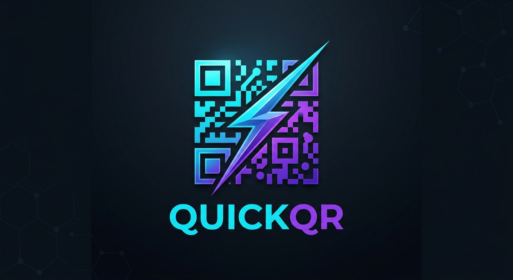

<p align="center">
  
</p>

<h1 align="center">QuickQR ⚡</h1>

<p align="center">
  <b>Gerador de QR Code Desktop Rápido, Elegante e Sem Dependências</b>
</p>

<p align="center">
  <a href="https://github.com/ramadanismael/QuickQR"></a>
  
  
  
</p>

---

**QuickQR** é uma aplicação desktop moderna, leve e ultra-rápida desenvolvida para geração instantânea de códigos QR a partir de qualquer texto ou URL.

Construída com **Avalonia UI**, **SukiUI** e **.NET**, a aplicação oferece um visual elegante em Dark Mode, preview em tempo real e exportação direta em alta resolução.

---

## 📸 Demonstração

<p align="center">
  
</p>

---

## 🚀 Download & Execução (Zero Dependências!)

Você **não precisa instalar o .NET SDK, dependências ou runtimes** para usar o QuickQR. O aplicativo foi compilado como **Standalone / Self-Contained**, ou seja, tudo o que ele precisa para rodar já está empacotado no próprio executável!

### 📥 Binários Prontos (`v1.0.0`)

Os executáveis já estão prontos dentro da pasta `publish/` do repositório ou nas Releases:

* **🪟 Windows (`win-x64`)**:
  * Acesse a pasta `publish/win-x64/`.
  * Clique duas vezes no arquivo `QuickQR.exe` para rodar imediatamente.

* **🐧 Linux (`linux-x64`)**:
  * Acesse a pasta `publish/linux-x64/`.
  * Dê permissão de execução (se necessário) e rode:
    ```bash
    chmod +x QuickQR
    ./QuickQR
    ```

---

## ✨ Funcionalidades

* ⚡ **Geração Instantânea & Live Preview**: Veja o QR Code sendo atualizado e renderizado em tempo real no painel lateral enquanto você digita.
* 🎛️ **Controle de Correção de Erros (Error Correction)**: Escolha entre os níveis de tolerância a falhas (*Low*, *Medium*, *Quartile*, *High*).
* 📏 **Ajuste Dinâmico de Tamanho (Module Size)**: Defina a resolução e dimensão dos módulos do código QR em tempo real através do slider.
* 💾 **Exportação em PNG**: Exporte o QR Code gerado em alta definição no formato `.png` com apenas um clique.
* 🎨 **Interface Moderna (SukiUI)**: Design limpo, responsivo e adaptado com tema escuro elegante.
* 📊 **Métricas do Código**: Exibe a contagem exata de caracteres inseridos e o tamanho final da imagem gerada em pixels (ex: `17 character(s), 396x396px`).

---

## 🛠️ Tecnologias Utilizadas

* **Linguagem**: C# (.NET Core)
* **UI Framework**: [Avalonia UI](https://avaloniaui.net/) (Cross-platform UI)
* **Design System**: [SukiUI](https://github.com/kikipoulet/SukiUI) (Modern UI Controls & Themes)
* **Arquitetura**: MVVM (Model-View-ViewModel)

---

## 📁 Estrutura do Projeto

```text
QuickQR/
├── docs/                # Documentação e imagens (logo.png, screenapp.png)
├── publish/             # Binários prontos para uso (Self-contained)
│   ├── linux-x64/       # Executável para Linux
│   └── win-x64/         # Executável para Windows
├── src/
│   ├── Assets/          # Ícones e recursos visuais (logo.ico)
│   ├── Configs/         # Configurações de UI, SukiViews e base MVVM
│   ├── Services/        # Lógica de geração de QR Code (IQrCodeService)
│   ├── ViewModels/      # ViewModels (QrGeneratorViewModel, WindowViewModel)
│   └── Views/           # Interfaces XAML (QrGeneratorView, WindowView)
├── QuickQR.csproj       # Arquivo de projeto .NET
└── README.md
```

---

## 💻 Compilando a partir do Código Fonte (Desenvolvedores)

Se você for um desenvolvedor e desejar alterar o código fonte ou gerar uma nova build, você precisará do **.NET SDK** instalado.

1. Clone o repositório:
   ```bash
   git clone https://github.com/ramadanismael/QuickQR.git
   cd QuickQR
   ```

2. Restaure as dependências e compile o projeto:
   ```bash
   dotnet restore
   dotnet build
   ```

3. Execute a aplicação:
   ```bash
   dotnet run --project QuickQR.csproj
   ```

4. Para publicar novos executáveis Standalone (Zero-Dependency):
   ```bash
   # Windows 64-bit
   dotnet publish -c Release -r win-x64 --self-contained

   # Linux 64-bit
   dotnet publish -c Release -r linux-x64 --self-contained
   ```

---

## 📄 Licença

Este projeto está sob a licença **MIT**. Veja o arquivo [LICENSE](LICENSE) para mais detalhes.

---

Built with ❤️ using .NET.
