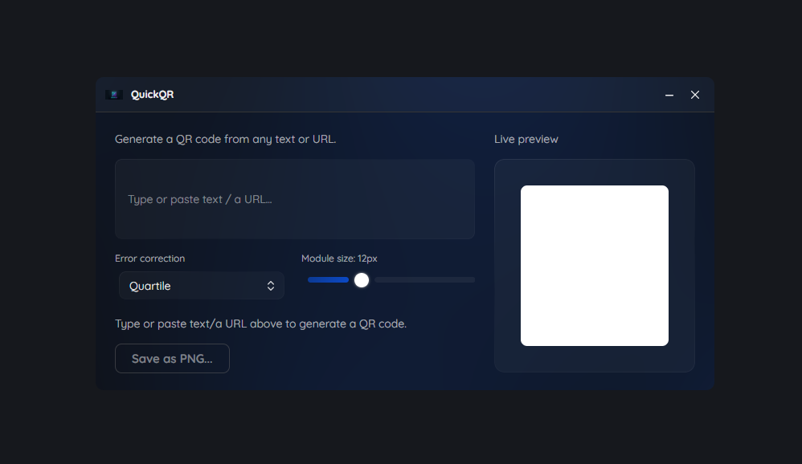
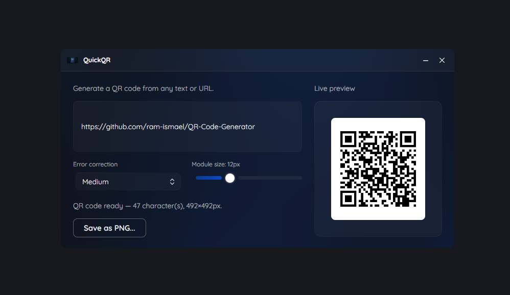
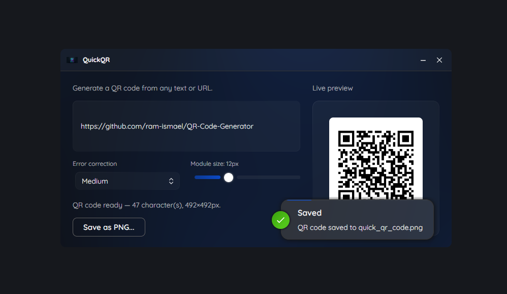

<p align="center">
  
</p>

<h1 align="center">QuickQR ⚡</h1>

<p align="center">
  <b>The fastest, sleekest, dependency-free desktop QR Code generator you'll ever use.</b><br/>
  Type. Watch the QR Code appear in real time. Export. Done.
</p>

<p align="center">
  <a href="https://github.com/ram-ismael/QuickQR-Code-Generator/stargazers"></a>
  <a href="https://github.com/ram-ismael/QuickQR-Code-Generator/network/members"></a>
  <a href="https://github.com/ram-ismael/QuickQR-Code-Generator/releases"></a>
  
  
</p>

<p align="center">
  <a href="#-download--run-zero-dependencies">Download</a> ·
  <a href="#-demo">Demo</a> ·
  <a href="#-features">Features</a> ·
  <a href="#-tech-stack">Tech Stack</a> ·
  <a href="#-building-from-source-developers">Build</a>
</p>

---

Tired of generating QR Codes on ad-filled websites that track what you type, or that require an internet connection just to create a simple code? **QuickQR** fixes that: a **100% desktop, offline, native app** that generates your QR Code instantly as you type — no waiting, no data ever leaving your machine.

It delivers a clean, fluid experience in Dark Mode, with real-time preview and direct high-resolution export.

If you like the idea, drop a ⭐ on the repo — it really helps the project grow!

---

## 📸 Demo

<p align="center">
  
</p>

<p align="center">
  
  
</p>

<p align="center"><i>A QR Code generated in seconds by QuickQR:</i></p>

<p align="center">
  
</p>

---

## 🚀 Download & Run (Zero Dependencies!)

You **don't need to install the .NET SDK, dependencies, or runtimes** to use QuickQR. The app is compiled as **Standalone / Self-Contained** — everything it needs to run is already packed into the executable!

```bash
git clone https://github.com/ram-ismael/QuickQR-Code-Generator.git
cd QuickQR-Code-Generator
```

### 📥 Ready-to-Run Binaries (`v1.0.0`)

The executables are already available inside the `publish/` folder of the repository, or in the [Releases](https://github.com/ram-ismael/QuickQR-Code-Generator/releases):

* **🪟 Windows (`win-x64`)**
  * Go to the `publish/win-x64/` folder.
  * Double-click `QuickQR.exe` to run it immediately.

* **🐧 Linux (`linux-x64`)**
  * Go to the `publish/linux-x64/` folder.
  * Grant execute permission (if needed) and run:
    ```bash
    chmod +x QuickQR
    ./QuickQR
    ```

---

## ✨ Features

| | |
|---|---|
| ⚡ **Instant Generation & Live Preview** | Watch the QR Code update and render in real time in the side panel as you type. |
| 🎛️ **Error Correction Control** | Choose between fault-tolerance levels (*Low*, *Medium*, *Quartile*, *High*). |
| 📏 **Dynamic Size Adjustment** | Set the resolution and module size of the QR Code in real time with a slider. |
| 💾 **PNG Export** | Export the generated QR Code in high definition as `.png` with a single click. |
| 🎨 **Modern Interface** | Clean, responsive design with an elegant dark theme. |
| 📊 **Code Metrics** | Displays the exact character count and final image size in pixels (e.g. `17 character(s), 396x396px`). |
| 🔌 **100% Offline** | No data ever leaves your machine. No ads, no tracking, no internet required. |

---

## 🛠️ Tech Stack

* **Language**: C# (.NET Core)
* **Architecture**: MVVM (Model-View-ViewModel)

---

## 📁 Project Structure

```text
QuickQR-Code-Generator/
├── docs/                # Documentation and images (logo.png, screenshots, etc.)
├── publish/             # Ready-to-use binaries (Self-contained)
│   ├── linux-x64/       # Linux executable
│   └── win-x64/         # Windows executable
├── src/
│   ├── Assets/          # Icons and visual resources (logo.ico)
│   ├── Configs/         # UI configs and base MVVM setup
│   ├── Services/        # QR Code generation logic (IQrCodeService)
│   ├── ViewModels/       # ViewModels (QrGeneratorViewModel, WindowViewModel)
│   └── Views/            # XAML interfaces (QrGeneratorView, WindowView)
├── QuickQR.csproj        # .NET project file
└── README.md
```

---

## 💻 Building from Source (Developers)

If you're a developer and want to modify the source code or produce a new build, you'll need the **.NET SDK** installed.

1. Clone the repository:
   ```bash
   git clone https://github.com/ram-ismael/QuickQR-Code-Generator.git
   cd QuickQR-Code-Generator
   ```

2. Restore dependencies and build the project:
   ```bash
   dotnet restore
   dotnet build
   ```

3. Run the app:
   ```bash
   dotnet run --project QuickQR.csproj
   ```

4. To publish new standalone (zero-dependency) executables:
   ```bash
   # Windows 64-bit
   dotnet publish -c Release -r win-x64 --self-contained

   # Linux 64-bit
   dotnet publish -c Release -r linux-x64 --self-contained
   ```

---

## 🤝 Contributing

Contributions are very welcome! If you have an idea, found a bug, or want to add a feature:

1. Fork the project
2. Create a branch (`git checkout -b feature/my-feature`)
3. Commit your changes (`git commit -m 'feat: my new feature'`)
4. Push to the branch (`git push origin feature/my-feature`)
5. Open a Pull Request

---

## ⭐ Like the project?

If QuickQR was useful to you, consider leaving a **star** on the repository — it helps other people discover the project and motivates me to keep improving it!

---

## 📄 License

This project is licensed under **MIT**. See the [LICENSE](LICENSE) file for details.

---

<p align="center">Designed and developed with ❤️  by <a href="https://github.com/ram-ismael">Ramadan Ismael</a>.</p>
